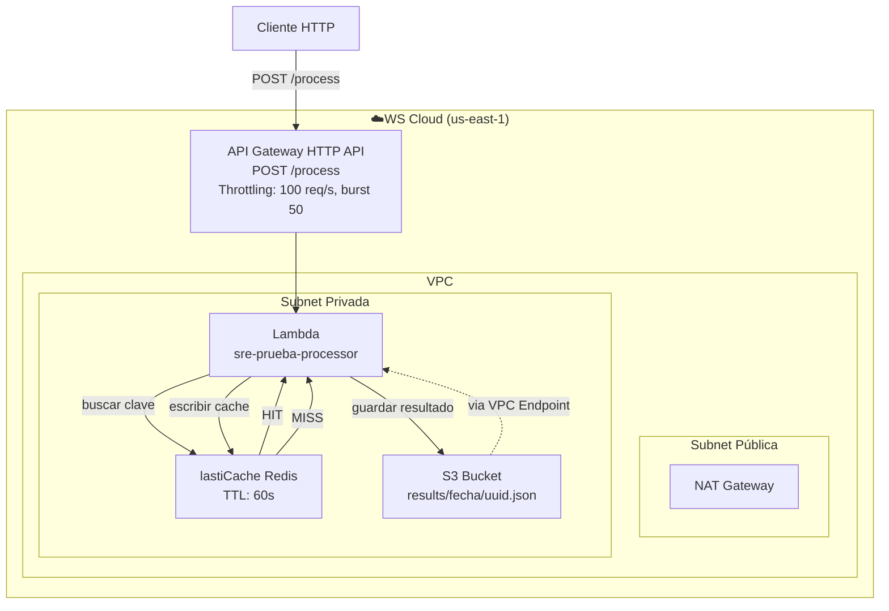

# SRE Prueba Técnica — Servicio de Procesamiento de Datos
#Jairo Andres Mendoza P.

## Diagrama de Arquitectura



## Pre-requisitos

- Terraform >= 1.15
- AWS CLI >= 2.0
- Python >= 3.12
- Cuenta AWS con permisos de AdministratorAccess
- Credenciales configuradas con `aws configure`

## Pasos para Desplegar

### 1. Clonar el repositorio
```bash
git clone <url-del-repositorio>
cd sre-prueba
```

### 2. Empaquetar el código de Lambda
```bash
cd lambda
pip3 install redis -t . --break-system-packages
zip -r function.zip .
cd ..
```

### 3. Inicializar y aplicar Terraform
```bash
cd terraform
terraform init
terraform apply
```

### 4. Obtener la URL del API Gateway
```bash
terraform output api_gateway_url
```

## Verificar el Flujo End-to-End

### Primer request — debe retornar X-Cache: MISS
```bash
curl -X POST "<API_GATEWAY_URL>" \
  -H "Content-Type: application/json" \
  -d '{"dato": "hola mundo"}' \
  -i
```

### Segundo request — debe retornar X-Cache: HIT
```bash
curl -X POST "<API_GATEWAY_URL>" \
  -H "Content-Type: application/json" \
  -d '{"dato": "hola mundo"}' \
  -i
```

### Verificar objetos en S3
```bash
aws s3 ls s3://sre-prueba-results/results/ --recursive
```

## Decisiones de Diseño

### HTTP API vs REST API
Se eligió HTTP API porque:
- Menor latencia y más simple
- Suficiente para este caso de uso
- Más económico que REST API
- Soporte nativo para CORS y throttling

### Tipo de nodo Redis
Se eligió cache.t3.micro porque:
- Es el más económico disponible
- Suficiente para una capa de caché
- La prueba no requiere alta disponibilidad

### VPC Endpoint para S3
Se configuró un VPC Endpoint tipo Gateway para S3:
- El tráfico entre Lambda y S3 nunca sale a internet
- Más seguro y más rápido
- Sin costo adicional (Gateway endpoints son gratuitos)

### Seguridad
- Lambda en subnets privadas sin acceso directo a internet
- Redis solo acepta conexiones desde el Security Group de Lambda
- S3 con Block Public Access en las 4 configuraciones
- IAM con principio de mínimo privilegio

## Destruir la Infraestructura
```bash
cd terraform
terraform destroy
```


### AWS Real vs LocalStack
Se intentó usar LocalStack como simulador local de AWS
para evitar costos, pero se descartó porque:
- ElastiCache Redis no está disponible en el plan gratuito
- API Gateway presentó errores de autenticación
- Se optó por AWS real con capa gratuita
- Los recursos se destruyen con `terraform destroy`
  inmediatamente después de la prueba para minimizar costos
- Costo estimado total: menos de $1 USD
